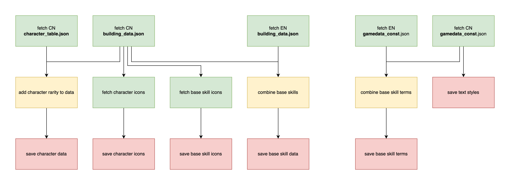

## Introduction

`riic-fetch` is a program for fetching and processing Arknights game data. It is used within the [RIIC Engine](https://github.com/ark-db/riic-engine) project to keep assets up to date.

## Overview

## Data sources

`riic-fetch` utilizes the following sources:

- [ArknightsGameData](https://github.com/Kengxxiao/ArknightsGameData)
- [ArknightsGameData_YoStar](https://github.com/Kengxxiao/ArknightsGameData_YoStar)
- [arkdata](https://github.com/astral4/arkdata)